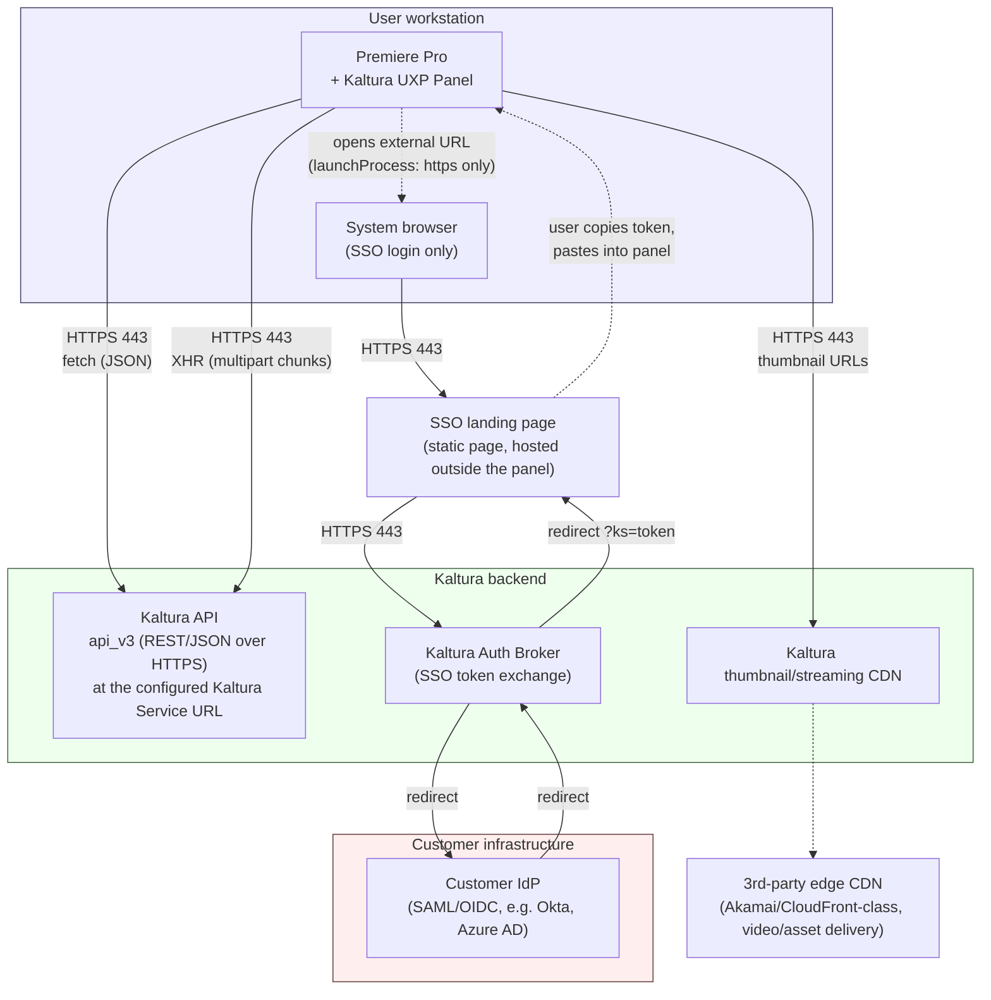
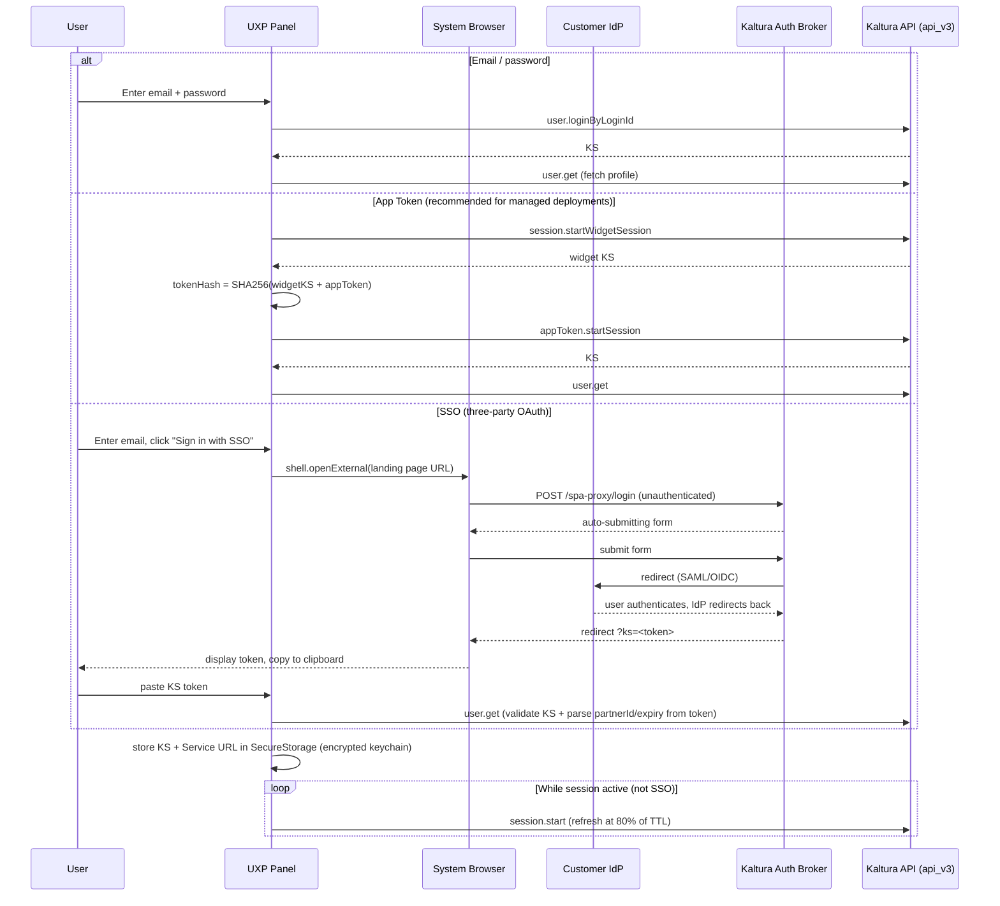
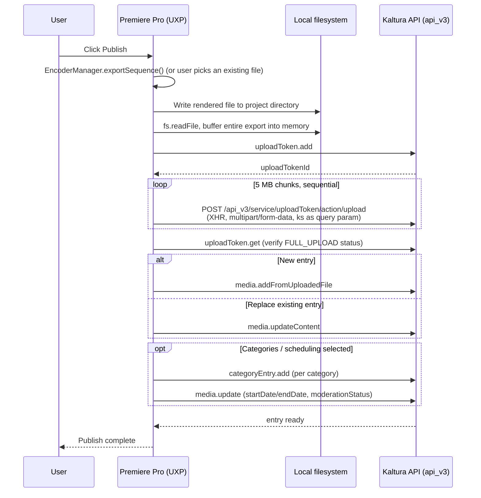

# Architecture & Network Flows

This document is for IT/security teams onboarding the Kaltura for Adobe Creative Cloud plugin. It covers system components, network protocols, and the two flows that matter most for a network review: authentication and publish (export → upload).

It's written to be generic across any organization deploying this plugin — it refers to **"the Kaltura Service URL"** rather than any specific hostname, because that value is unique to each Kaltura account (multi-tenant SaaS region, private cloud, or on-premises). Get your account's exact Service URL and any other endpoint hostnames from your Kaltura account team before finalizing firewall rules.

## Component overview

**Key points for firewall/proxy rules:**

| Endpoint                                                                                                        | Protocol/Port | Direction                      | Purpose                                                         |
| --------------------------------------------------------------------------------------------------------------- | ------------- | ------------------------------ | --------------------------------------------------------------- |
| Kaltura Service URL (account-specific — see below)                                                              | HTTPS/443     | Outbound from workstation      | Kaltura REST API (`api_v3`): login, upload, media/publish calls |
| Kaltura thumbnail/streaming CDN (typically a subdomain under the same Kaltura domain family as the Service URL) | HTTPS/443     | Outbound                       | Thumbnail image delivery                                        |
| 3rd-party edge CDN (Akamai/CloudFront-class)                                                                    | HTTPS/443     | Outbound                       | Video/asset delivery                                            |
| SSO landing/callback page (static page hosted outside the panel)                                                | HTTPS/443     | Outbound (system browser only) | SSO token hand-off UI                                           |
| Kaltura Auth Broker                                                                                             | HTTPS/443     | Outbound (system browser only) | SSO token exchange                                              |
| Customer IdP (SAML/OIDC endpoint)                                                                               | HTTPS/443     | Outbound (system browser only) | Customer identity provider login                                |

No custom ports are used anywhere. Every connection is standard HTTPS (443). The plugin's `KalturaClient` rejects any non-HTTPS server URL at configuration time.

**Why the manifest's network permission is `"all"` rather than a fixed domain list:** Kaltura accounts connect to different hosts depending on deployment type — multi-tenant SaaS (in one of several regions), private cloud, or fully on-premises. There is no single fixed domain that covers every possible account.

The Login panel offers a dropdown of known SaaS regions plus a "Custom" field, so any account — including private cloud/on-prem — can set its own Kaltura Service URL. Because that value isn't knowable in advance for every customer, UXP's static manifest permission model (`requiredPermissions.network.domains`, set once at install time with no runtime prompt) can't be scoped to a fixed list without breaking accounts outside the known SaaS regions. The options are an exact list of every known domain or the literal `"all"`. This plugin uses `"all"` to support every deployment type without limiting which organizations can install it.

In practice, the plugin still only ever talks to whichever single Service URL is configured for that install — `"all"` widens what the manifest _permits_, not what the plugin _does_. Your firewall rules only need to allow that one Service URL (plus the CDN/SSO endpoints above), not "all" domains.

The manifest also declares one permission that carries no traffic today: `wss://` connections would back a `NotificationService` module (real-time entry-status push over WebSocket, with HTTP polling as fallback) that exists in the codebase but is not instantiated by any panel in the current build. It needs no firewall allowance for this plugin to function.

The Auth Broker and IdP legs run entirely in the **system browser** (`uxp.shell.openExternal`), not inside the UXP panel's sandboxed network context. That's why those endpoints don't appear in the plugin's own `manifest.json` network allowlist. Only the manually pasted-back session token re-enters the panel.

## Authentication flows

The panel supports three login methods. All three end with a **Kaltura Session (KS)** token stored in the OS-level encrypted keychain (UXP `SecureStorage`), never in `localStorage`. The Kaltura Service URL used for that session is stored alongside it, so a relaunch reconnects to the same server the session was issued from rather than defaulting elsewhere.

**Per-method notes:**

- **Email/password** and **App Token** sessions default to a 24-hour KS TTL and auto-refresh at 80% of that TTL via `session.start`.
- **SSO** sessions carry whatever expiry the customer's Auth Broker/IdP issued (read directly out of the KS payload) and are **not** auto-refreshed. The plugin holds no admin credential to mint a new SSO session, so the user re-runs the browser flow on expiry.
- The KS is sent as a `ks` field in the JSON body on ordinary API calls, but as a **URL query parameter** on upload-chunk requests (see below). Both cases are over HTTPS.

## Export & publish flow

**Notes:**

- The exported file is fully buffered client-side (no streaming) before chunking begins.
- Chunks are sent via `XMLHttpRequest`, not `fetch`, to get upload-progress callbacks. Multipart bodies are built manually (UXP's `FormData`/`Blob` is unreliable for binary payloads).
- Chunk size is fixed at 5 MB. Per-chunk timeout is 10 minutes; standard API calls time out at 30 seconds.
- All requests carry a client tag identifying the plugin version (`kaltura-premiere-panel:v<version>`) for server-side traceability.

## Summary for network/security review

- Single outbound protocol in active use: **HTTPS/443**. No inbound ports, no P2P, no non-standard ports. The plugin only ever talks to the one Kaltura Service URL configured on the Login panel, even though the manifest's network permission is declared broadly (see "Why the manifest's network permission is `all`" above).
- Two network contexts: the UXP panel's sandboxed `fetch`/XHR (the configured Kaltura Service URL + CDN domains), and the OS system browser (SSO login only, reaches the Kaltura Auth Broker and the customer's own IdP).
- Session tokens live only in the OS-encrypted keychain (UXP `SecureStorage`), never in `localStorage`, never written to disk unencrypted.
- No admin/API secrets are embedded in the plugin. SSO and App Token flows are designed so the client never needs one.
- See [`sso-setup.md`](./sso-setup.md) for SSO admin-side configuration and [`enterprise-deployment.md`](./enterprise-deployment.md) for the firewall domain allowlist and deployment mechanics.
